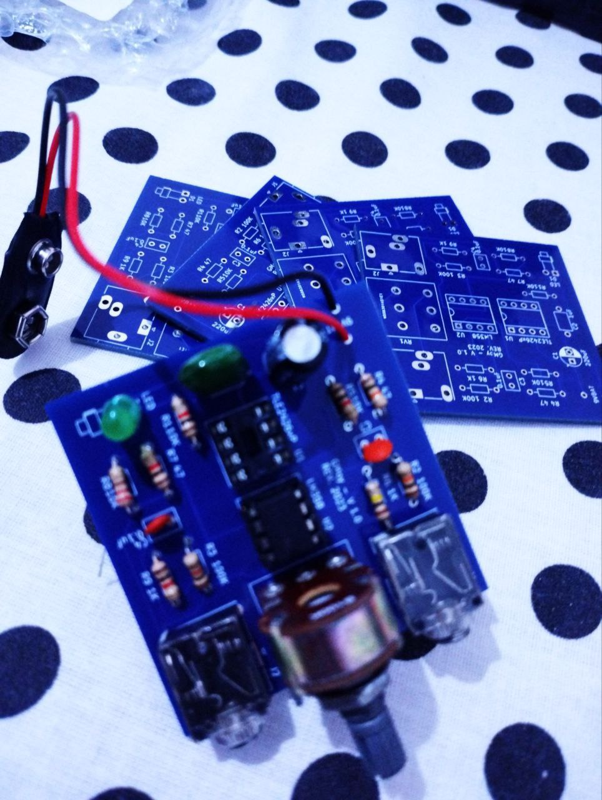
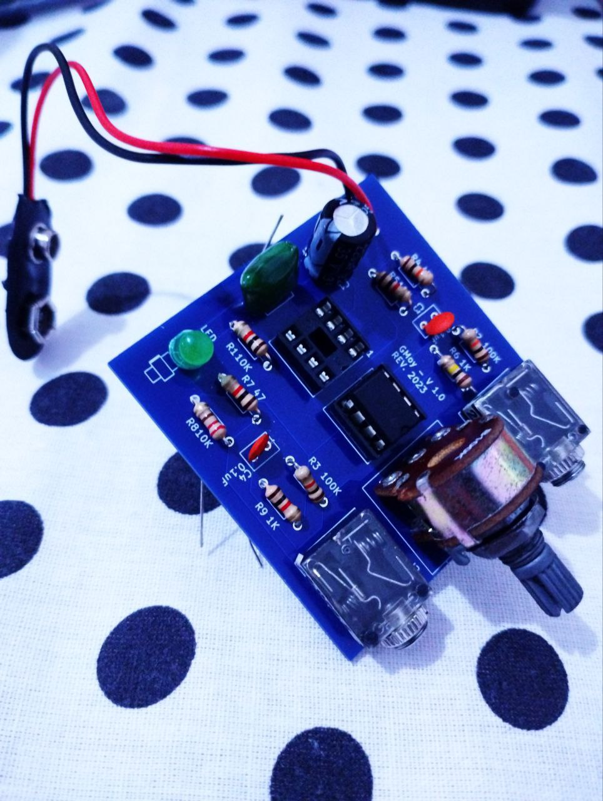
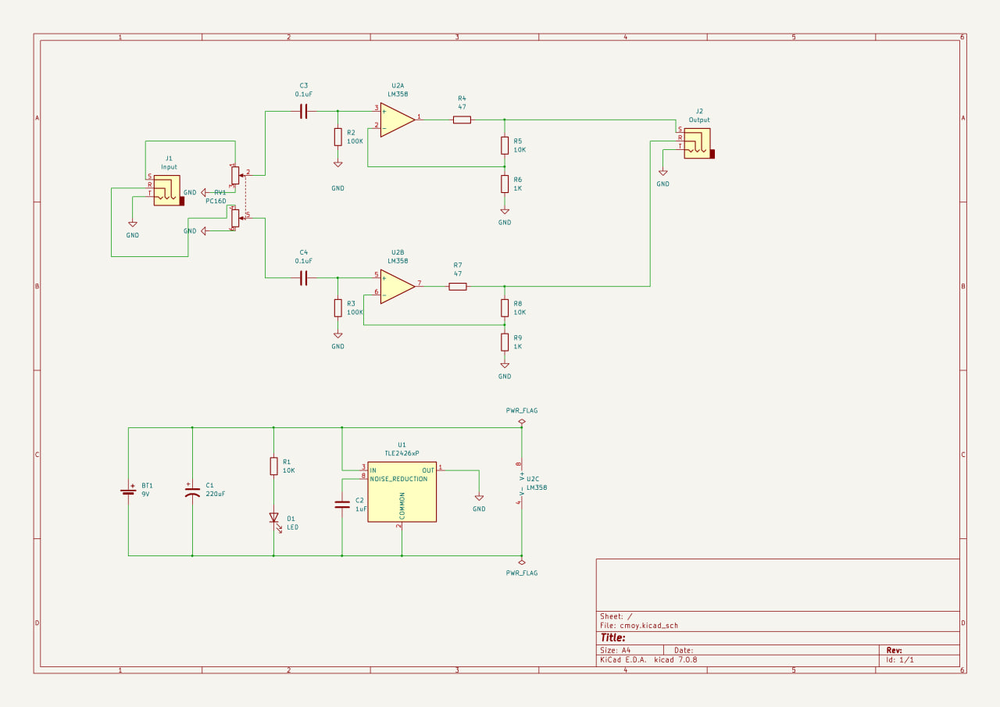
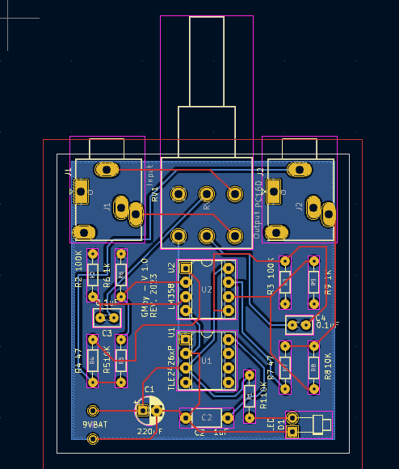
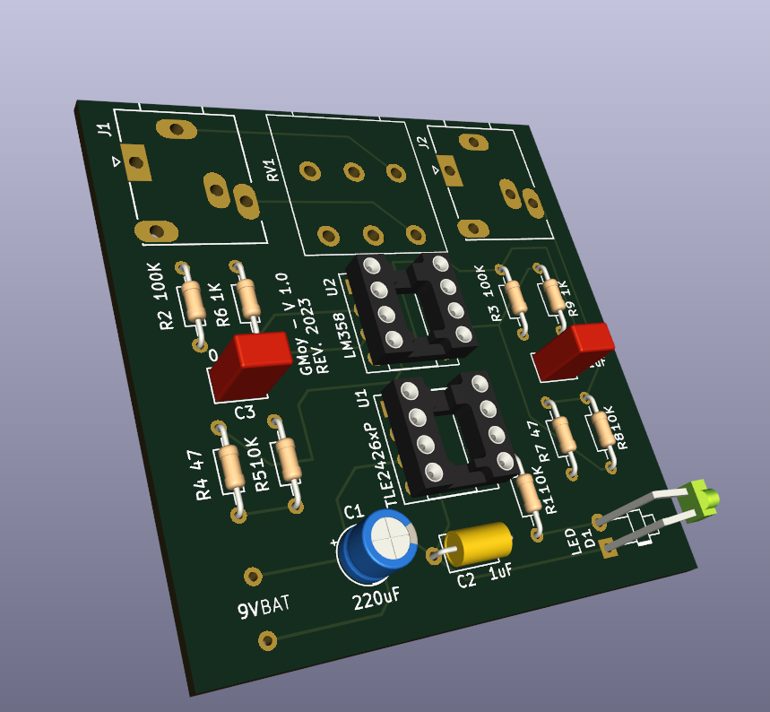
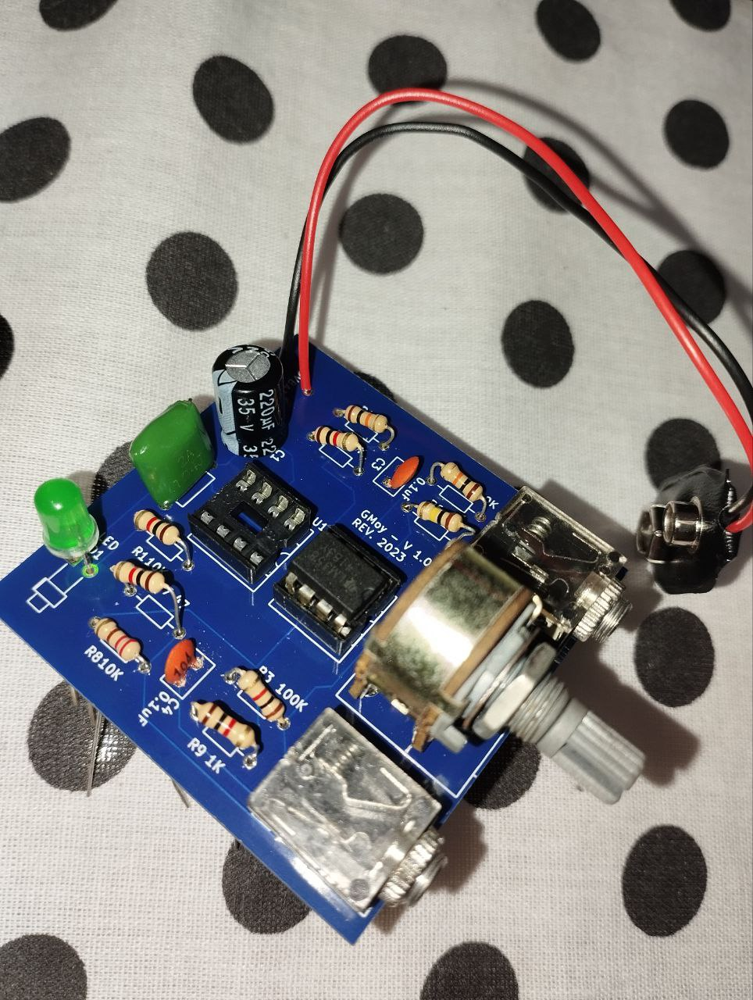
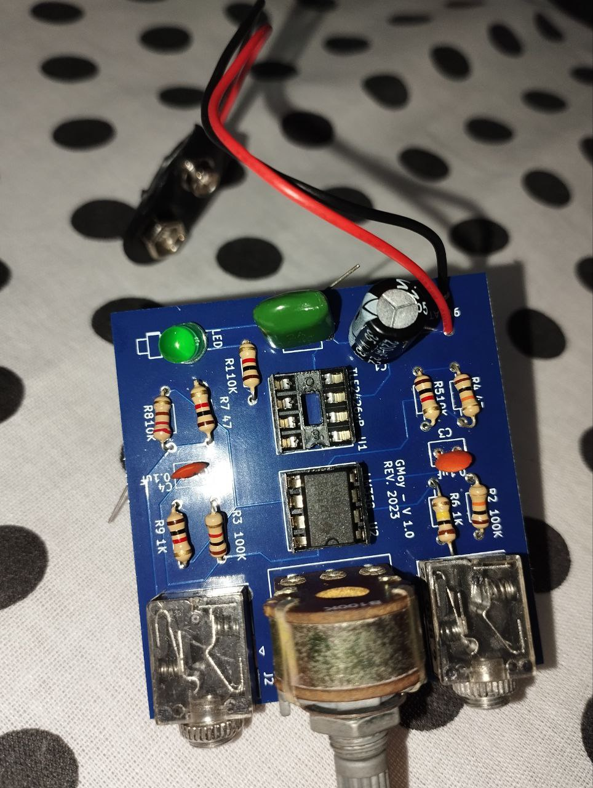

# GMoy-Amplifier

_revision 2023 - V1.0_

Variation of the famous CMoyBB pocket amplifier that fits inside of an Altoids tin can. Powered by a 9V battery and leveraging standard double Amp-Op integrated circuits to increase sound fidelity and capability for the _on-the-go_ audiophile.

PCB fabrication for this project was sponsered by [PCBWay](https://www.pcbway.com/), and I would like to thank them for their support! I was very happy with the quality of the PCBs they sent me, and their staff was very easy to work with, especially Liam who was my liason during this project and exercised a lot of patience on seeing this through to the end!

_Fully assembled PCB (except for a missing voltage-reference IC), supplied by PCBWay and hand assembled by me._

## Instructions

The design is extremely straight-forward, once all components are in place and soldered, all you have to do is have a P2-P2 cable that will connect the board to your smartphone, computer, etc and a headphone/headset/earphone with a P2 interface to connect to the PCB aswell. Once that's in place, the potentiometer can be used to adjust output volume.

## Design

The circuit is an extremely simple non-inverting operational amplifier topology. Each channel has it's own separate amplifier (provided by the LM358 IC) and both channels are supplied with a very stable input voltage of +9/-9 generated through the use a voltage-divider (virtual ground) IC (TLE2426) and a standard 9V battery.

Input and output is done through a pair of 5-pin P2 jacks, while volume control is done through a linear 10K double-potentiometer (PC16D).

The entire BOM can be extracted from the gerber files available in the `Fabrication Output` folder or by generating it using KiCad files provided within the `cmoy` folder.

## PCB Fabrication

Unless you're lucky enough to have PCB fabrication facilities in house, you'll need to send the Gerber files to a third-party manufacturer for fabrication. I wasn't sure who to go to, but after a previous project, [PCBWay](https://www.pcbway.com/) reached out to me and offered to sponsor PCB fabrication. Their interface was very intuitive and by following good practices in PCB design, there was minimal, if any, adjustments done to the board layout before sending it to them.

The care given for packaging cannot be understated aswell as the consistent follow-up on order and delivery status being given not just by the staff but also by their online system, which all but guaranteed that everything was as smooth as possible.

The board has an amazing finish, and through the entire process I haven't been able to find any manufacturing defects in any of the boards that were delivered to me. Their low MOQ (and very competitive pricing), not to mention the amount of customization they allowed, made me a very satisfied customer.

## More pictures (:

## License

This work is licensed under a [Creative Commons Attribution-NonCommercial 4.0 International License](https://creativecommons.org/licenses/by-nc/4.0). You are free to share, use, and modify this work for any non-commercial reasons as long as you give appropriate credit. The author grants permission for PCB and CAD design files to be sent to third-party manufacturers for fabrication as long as these fabricated parts or assemblies containing these fabricated parts are not later resold for profit.
